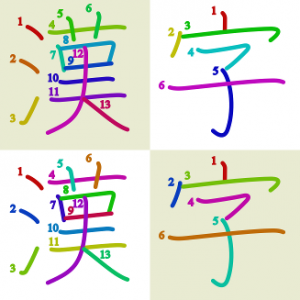

.. image:: https://circleci.com/gh/cayennes/kanji-colorize.svg?style=svg
    :target: https://circleci.com/gh/cayennes/kanji-colorize

==============
KanjiColorizer
==============

About
-----

``kanji_colorize.py`` is a script for coloring, resizing, and renaming
the stroke order diagrams from the
`KanjiVG <http://kanjivg.tagaini.net/>`_ project.  I wrote it to create
sets that make it possibe to easily add stroke order diagrams to an
`anki <http://ankisrs.net/>`_ kanji deck, but they can be used for
anything you want some nicely colored stroke order diagrams for.

If you'd prefer not to bother running a python script, there are some
sets of stroke order diagrams generated with it available for download.

Getting diagrams
----------------

If you just want some colorted diagrams, you can get them on the
`github releases page <https://github.com/cayennes/kanji-colorize/releases>`_.

I've packaged up a spectrum set and a contrast set. The spectrum set
colors the strokes in rainbow order and is nice because the you can see
at a glance how the kanji is put together, but has the disadvantage that
stokes next to each other are similar colors, and color is sometimes
necessary to tell which number goes with which stroke. The contrast set
maximizes the contrast between any set of consecutive strokes.  (This
uses the golden ratio.  Math is nifty.)

Using with Anki
---------------

There is an `addon for Anki2 <https://ankiweb.net/shared/info/1964372878>`_
that generates colored diagrams for all of your kanji cards.  You can install
it with code `1964372878`.

Downloading and Running the Software
------------------------------------

The `kanji_colorize.py` script makes it possible to generate diagrams to your
own specifications.  It may have issues with a python not built with
wide-character support

Feedback
--------

If there's anything you think would improve these, you can use the
`issue tracker <https://github.com/cayennes/kanji-colorize/issues>`_ or
email me at cayennes@gmail.com.

If you find any errors in image files generated by the most recent
version of kanji colorizer, check to see whether they have been fixed in
the KanjiVG data by looking at
`their online kanji viewer <http://kanjivg.tagaini.net/viewer.html>`_.
If it is correct there, it means that I didn't notice that there was an
update; let me know and I'll fix it.  If the error exists there, let the
KanjiVG project know using
`their issue tracker <https://github.com/KanjiVG/kanjivg/issues>`_.

Development
-----------

Have you created an improvement to KanjiColorizer that you think
other people would also like to have?  If so, please submit a patch or a
pull request!  I'm not always very prompt but I do get to them
eventually.

Please make sure existing tests pass.  Even better, add new tests for
anything you add.  Either doctest or unittest is fine, though ideally
the doctests would contain executable examples that fully illustrate the
function and the unittest tests would contain further worthwhile checks.

The first time you clone the project, you need to get the submodule with the uncolored diagrams:

.. code:: bash
    $ git submodule init
    $ git submodule update

Activate the virtual environment and install requirements:

.. code:: bash

    $ python3 -m venv venv
    $ source venv/bin/activate
    $ pip install -r requirements.txt

To run the existing tests:

.. code:: bash

    $ python -m kanjicolorizer.colorizer
    $ python -m unittest discover -s kanjicolorizer

To create a new release:

.. code :: bash

    $ paver dist_anki_addon

Test by unzipping the zip file in `dist` into a new directory in `~/.local/share/Anki2/addons21` (or the equivalent for the OS being tested).

License
-------

The code is available under the Affero GPL version 3 or later and the SVG
images are available under Creative Commons Attribution-Share Alike 3.0.
See file headers and files in ``licenses/`` for more information.
